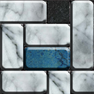
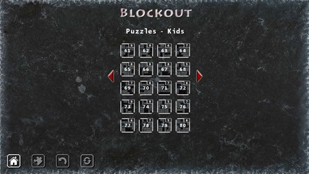
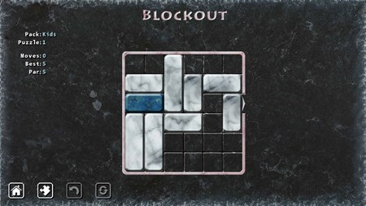

## Blockout v1.3 - uwp branch

R.E. of Phyron BlockOut  (Windows version of game). Planned as some "W10M UWP remake", special for Windows10Mobile retro-games.

## Scenario
Blockout is a simple and addictive puzzle game. Your goal is to get the blue block out of the board by sliding the other blocks out of the way.

- 6 difficulty levels from Kids to Expert
- Over 9000 unique puzzles for you to enjoy
- Undo any unwanted move
- See for any level the perfect number of moves

## Screenshots

## Status of UWP porting
-  UWP porting completed is in init / draft state

## References
- https://apps.microsoft.com/detail/9wzdncrdfwrq Original BlockOut 1.2.0.1 by Phyron (Windows Desktop only) 

## ToDo
- Complete uwp porting, assemble ARM package.

## .
As is. No support. Educational purposes only. DIY.

## ..
[M][E] June, 9 2025